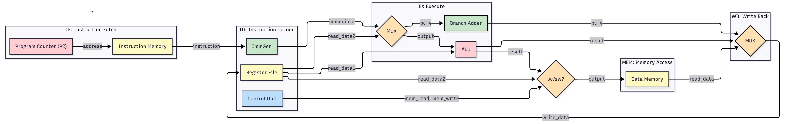

# riscv-5: Verified Pipelined Core

 

> A fully verified, 5-stage pipelined RISC-V processor (RV32I) implemented in SystemVerilog.

## Architecture Overview

This project is a Harvard-architecture RISC-V core designed to be cycle-accurate and strictly compliant to the ISA specification. Verification is prioritized by using the official RISC-V test suite (RISCOF) to validate every instruction against the standard golden model. 



### Features
- 5-Stage Pipeline: `IF`, `ID`, `EX`, `MEM`, `WB` stages with pipeline registers.
- Hazard Management: Resolves data, load-use, and control hazards to manage pipeline stalls and control flow.
- Verified Compliance: Passing the official RISC-V rv32i_m/I architectural test suite.
- Automated CI/CD: GitHub Actions workflows that re-verify the core against the ISA spec.

### Supported Instructions (RV32I)

The core has been validated against the **RISC-V Architectural Test Suite** and supports the following instruction types:

- **Arithmetic:** `add`, `sub`, `addi`, `slt`, `sltu`, `slti`, `sltiu`
- **Logic:** `and`, `or`, `xor`, `andi`, `ori`, `xori`
- **Shifts:** `sll`, `srl`, `sra`, `slli`, `srli`, `srai`
- **Memory:** `lw`, `sw`, `lb`, `lbu`, `lh`, `lhu`, `sb`, `sh`
- **Control Flow:** `beq`, `bne`, `blt`, `bge`, `bltu`, `bgeu`, `jal`, `jalr`
- **Large Constants:** `lui`, `auipc`

## Compliance Testing

This project utilizes [RISCOF](https://github.com/riscv-software-src/riscof) (RISC-V Architectural Test Framework) to ensure strict adherence to the RISC-V Unprivileged Specification.

### Test Structure
- **DUT Plugin:** Python plugin located in `compliance/` that compiles the RTL using Icarus Verilog and executes tests.
- **Reference Model:** Uses [Spike](https://github.com/riscv-software-src/riscv-isa-sim) for golden-model comparison.
- **Verification:** Signatures are automatically extracted from the DUT's memory and compared against Spike's output.

### Running Compliance Tests Locally
To run the full suite (requires `riscof`, `spike`, and `riscv64-unknown-elf-gcc`):

```bash
./run_compliance.sh
```

## GitHub Actions CI/CD

The repository includes automated workflows to maintain code quality:
1.  **Basic CI (`ci.yml`)**: Runs to verify basic core functionality with custom assembly tests.
2.  **Compliance Suite (`compliance.yml`)**: A comprehensive workflow that builds Spike and runs the official RISC-V Architecture Test suite. 
    *   *Note: These are both configured with `workflow_dispatch` to be run manually or on PRs affecting core logic to optimize resource usage.*

## Tools & Requirements

- **Simulator:** [Icarus Verilog](https://steveicarus.github.io/iverilog/) (`iverilog`) v12.0+
- **Toolchain:** `riscv64-unknown-elf-gcc` (for test compilation)
- **Framework:** `riscof` (for architectural compliance)
- **Language:** SystemVerilog (IEEE 1800-2012)

## Running the project

For simple verification (using the Fibonacci sequence test):

```bash
iverilog -g2012 -o sim.out riscv_pkg.sv src/*.sv test/pipelined_cpu_tb.sv
vvp sim.out +TEST=mem/fib_test.mem
```

## Roadmap

Phase 1: Single-Cycle Core (Completed)
Phase 2: 5-Stage Pipelining (Completed)
Phase 3: ISA Completeness (Completed)

Phase 4: C-Readiness & Hardening (Completed)

- [x] **Complex Branching:** Implement BNE, BLT, BGE, etc., to support standard C control flow.
- [x] **Compliance:** Integrated RISCOF and passed the official RV32I test suite.
- [x] **Memory Expansion:** Increased I-Mem and D-Mem to 4MB each to support large binaries.
- [x] **MMIO Hardening:** Standardized `tohost` (0x80001000) for test termination.

Phase 5: FPGA & Peripherals (Future)

- [ ] UART: Implement Serial Transmit (MMIO) for printf support.
- [ ] Physical Constraints: Map pins to the specific FPGA board.

## References

- [Computer Organization and Design | The Hardware/Software Interface | RISC-V Edition by David A. Patterson & John L. Hennessy | Chapter 4 - The Processor](https://www.cs.sfu.ca/~ashriram/Courses/CS295/assets/books/HandP_RISCV.pdf)

- [The RISC-V Instruction Set Manual Volume I | Unprivileged Architecture](https://docs.riscv.org/reference/isa/_attachments/riscv-unprivileged.pdf)
