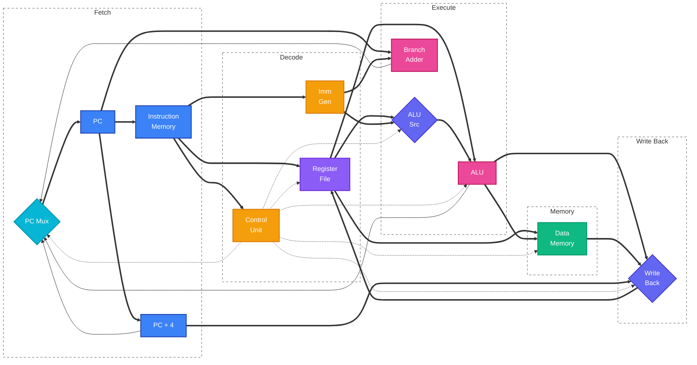
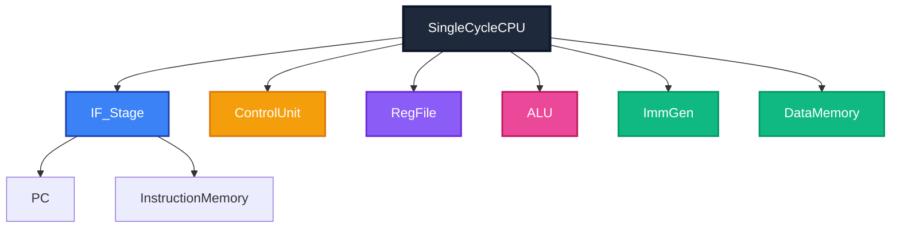

# 32-bit RISC-V CPU Core

This repository contains the design and verification files for a 32-bit RISC-V (RV32I) CPU core, implemented from scratch in SystemVerilog.

## Architecture Overview

The CPU implements a classic single-cycle Harvard architecture. It features a dedicated control unit handling 10 different control signals and a datapath capable of executing Arithmetic, Logic, Memory, Branch, and Jump operations in a single clock cycle.



## Supported Instructions (RV32I)

The core passes comprehensive verification tests for the following instruction types:

- **Arithmetic:** `add`, `sub`, `addi`, `slt`, `sltu`, `slti`, `sltiu`
- **Logic:** `and`, `or`, `xor`, `andi`, `ori`, `xori`
- **Shifts:** `sll`, `srl`, `sra`, `slli`, `srli`, `srai`
- **Memory:** `lw` (Load Word), `sw` (Store Word)
- **Control Flow:** `beq` (Branch Equal), `jal` (Jump & Link), `jalr` (Jump Register)

## Module Organization

The project is structured with the top-level `SingleCycleCPU` instantiating specific pipeline stages and logic units.



## Instruction Execution

Every instruction follows the same execution pipeline: fetch from instruction memory, decode and generate control signals, execute the operation in the ALU, access data memory if needed (loads/stores), write the result back to the register file, and update the PC.


## Tools & Requirements

- **Simulator:** [Icarus Verilog](https://steveicarus.github.io/iverilog/) (`iverilog`) is used for compiling and simulating the design.
- **Language:** SystemVerilog (IEEE 1800-2012)

## Running the project

The project includes a full regression testbench that verifies R-Type, I-Type, Memory, and Control Flow instructions in a single simulation run.

```bash
iverilog -g2012 -o cpu.out src/*.sv test/single_cycle_cpu_tb.sv
```

To run the simulation:

```bash
vvp sim.out
```

You can also compile a run the Fibonacci Sequence program by changing the memory file in `instruction_memory.sv` on `line 11`. After you change the memory file from `program.mem` to `fib_test.mem` you can compile `test/fib_test_tb.sv` and run it.

## Roadmap

Phase 1: Single-Cycle Core (Completed)

- [x] Implemented full datapath for R, I, S, B, and J type instructions.
- [x] Developed modular Control Unit with ALU decoding.
- [x] Verified functionality with Fibonacci and regression testbenches.

Phase 2: 5-Stage Pipelining (In Progress)

- [ ] **Pipeline Registers:** Insert registers between IF, ID, EX, MEM, and WB stages.
- [ ] **Hazard Unit:** Detect data hazards and insert bubbles (stalls).
- [ ] **Forwarding Unit:** Implement operand forwarding to resolve RAW hazards without stalling.
