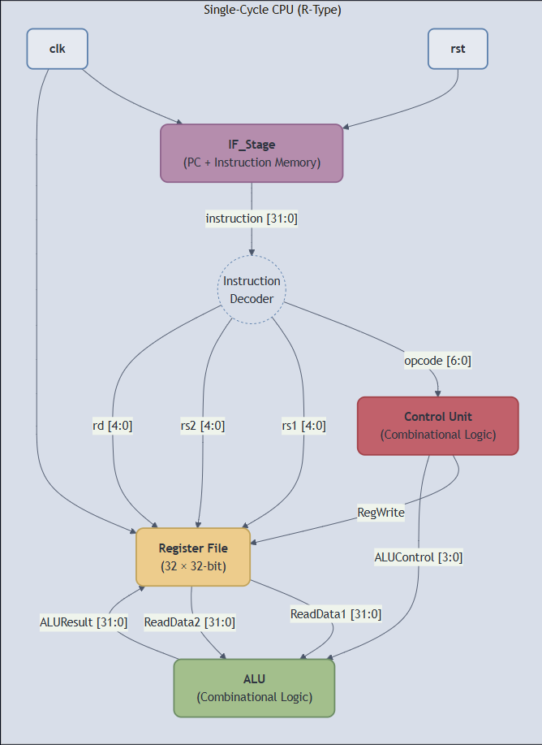

## 32-bit 5-Stage Pipelined RISC-V CPU Core

#### This repository contains the design and verification files for a 32-bit RISC-V (RV32I) CPU core, implemented from scratch in SystemVerilog.

#### Current Status & Features

###### The project has successfully implemented a complete single-cycle CPU core capable of fetching, decoding, and executing **R-type instructions**.

* **Arithmetic Logic Unit (ALU):** A 32-bit combinational ALU capable of performing ADD, SUB, AND, and OR operations.
* **Register File:** A 32x32 synchronous-write, asynchronous-read register file, correctly handling the zero-register (`x0`).
* **Instruction Fetch Stage:** A complete `IF_Stage` module with a Program Counter (`PC`) and Instruction Memory (`InstructionMemory`) that correctly fetches instructions from a program file.
* **Control Unit:** A combinational `ControlUnit` that decodes instruction `opcodes` and generates the correct control signals.
* **Single-Cycle CPU Core:** A top-level `SingleCycleCPU` module that integrates all components to fetch and execute a multi-instruction program.
* **Verification:** The core has been verified with a top-level, self-checking testbench (`single_cycle_cpu_tb.sv`) that initializes registers, runs a program from memory, and verifies the register values.

**Single-Cycle CPU Architecture:**


#### Tools & Requirements

* **Simulator:** [Icarus Verilog](https://steveicarus.github.io/iverilog/) (`iverilog`) is used for compiling and simulating the design.
* **Language:** SystemVerilog (IEEE 1800-2012)

#### Project Roadmap

##### Part 1: Complete Single-Cycle CPU (Current Goal)

The immediate goal is to build a **complete and robust single-cycle RISC-V (RV32I) CPU core** that can execute all major instruction types.
* [x] **R-Type:** `add`, `sub`
* [x] **I-Type (Immediate):** Add support for `addi`. This requires an Immediate Generator and a new MUX for the ALU.
* [ ] **I-Type (Load):** Add support for `lw` (load word). This requires adding a Data Memory and a MUX for the write-back data.
* [ ] **S-Type (Store):** Add support for `sw` (store word), which uses the Data Memory.
* [ ] **B-Type (Branch):** Add support for `beq` (branch if equal). This requires new logic to check the ALU's Zero flag and update the PC.
* [ ] **J-Type (Jump):** Add support for `jal` (jump and link).
* [ ] **Final Verification:** Create a comprehensive test program that uses all supported instructions to verify the full design.

##### Part 2: Future Improvements (5-Stage Pipeline)
After the single-cycle core is complete and fully verified, the project will be extended to a 5-stage pipelined processor to improve performance.
* [ ] **Convert to 5-Stage Pipeline:** Add pipeline registers to separate the design into IF, ID, EX, MEM, and WB stages.
* [ ] **Hazard & Forwarding Unit:** Implement logic to handle data and control hazards.

#### Running the project
To compile all the source files and the datapath testbench:
```bash
iverilog -g2012 -o cpu.out src/pc.sv src/instruction_memory.sv src/if_stage.sv src/alu.sv src/reg_file.sv src/control_unit.sv src/single_cycle_cpu.sv src/imm_gen.sv test/single_cycle_cpu_tb.sv
```
To run the simulation:
```bash
vvp sim.out
```