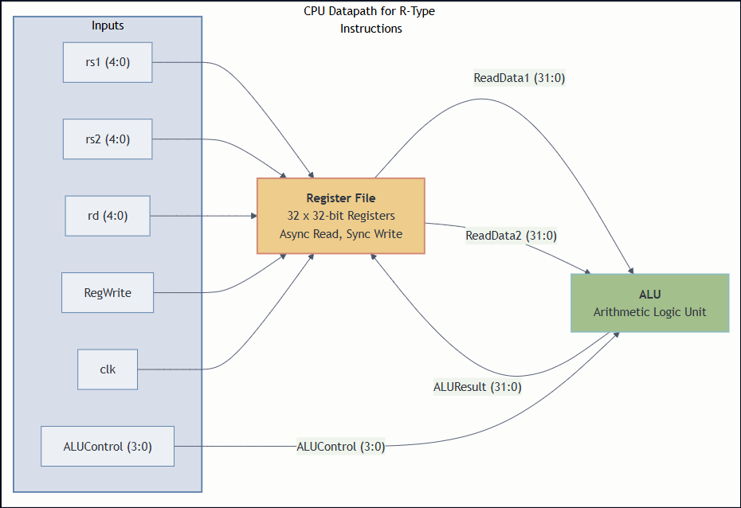

## 32-bit 5-Stage Pipelined RISC-V CPU Core

#### This repository contains the design and verification files for a 32-bit RISC-V (RV32I) CPU core, implemented from scratch in SystemVerilog.

This project is being developed to demonstrate a strong understanding of computer architecture, digital design, and modern hardware verification methodologies.

#### Current Status & Features

###### The project is currently in the single-cycle phase. The following components have been designed and verified:

* **Arithmetic Logic Unit (ALU):** A 32-bit combinational ALU capable of performing ADD, SUB, AND, and OR operations. Verified with a self-checking testbench.
* **Register File:** A 32x32 synchronous-write, asynchronous-read register file, correctly handling the zero-register (`x0`). Verified with a self-checking testbench.
* **Instruction Fetch:** A complete `IF_Stage` module with a Program Counter (`PC`) and Instruction Memory (`InstructionMemory`) that correctly fetches instructions from a program file.
* **Control Unit:** A combinational `ControlUnit` that decodes instruction `opcodes` and generates the correct control signals.
* **Single-Cycle CPU Core:** A top-level `SingleCycleCPU` module that integrates all components to fetch and execute a multi-instruction program.
* **Verification:** The core has been verified with a top-level, self-checking testbench (`single_cycle_cpu_tb.sv`) that initializes registers, runs a program from memory, and verifies the register values.

**This diagram illustrates the current datapath for executing R-type instructions:**



#### Tools & Requirements

* **Simulator:** [Icarus Verilog](https://steveicarus.github.io/iverilog/) (`iverilog`) is used for compiling and simulating the design.
* **Language:** SystemVerilog (IEEE 1800-2012)

#### Project Roadmap

###### The ultimate goal of this project is a fully-featured 5-stage pipelined core.

* **Instruction Fetch Logic:** Implement the Program Counter and instruction memory.
* **Full Single-Cycle Datapath:** Add support for I-type and memory instructions.
* **Control Unit:** Design the main control unit to decode instructions and generate control signals.
* **Convert to a 5-Stage Pipeline:** Add pipeline registers to seperate the design into IF, ID, EX, MEM, and WB stages.
* **Hazard and Forwarding Unit:** Implement logic to handle data and control hazards.

#### Running the project
To compile all the source files and the datapath testbench:
```bash
iverilog -g2012 -o cpu.out src/pc.sv src/instruction_memory.sv src/if_stage.sv src/alu.sv src/reg_file.sv src/control_unit.sv src/single_cycle_cpu.sv test/single_cycle_cpu_tb.sv
```
To run the simulation:
```bash
vvp sim.out
```